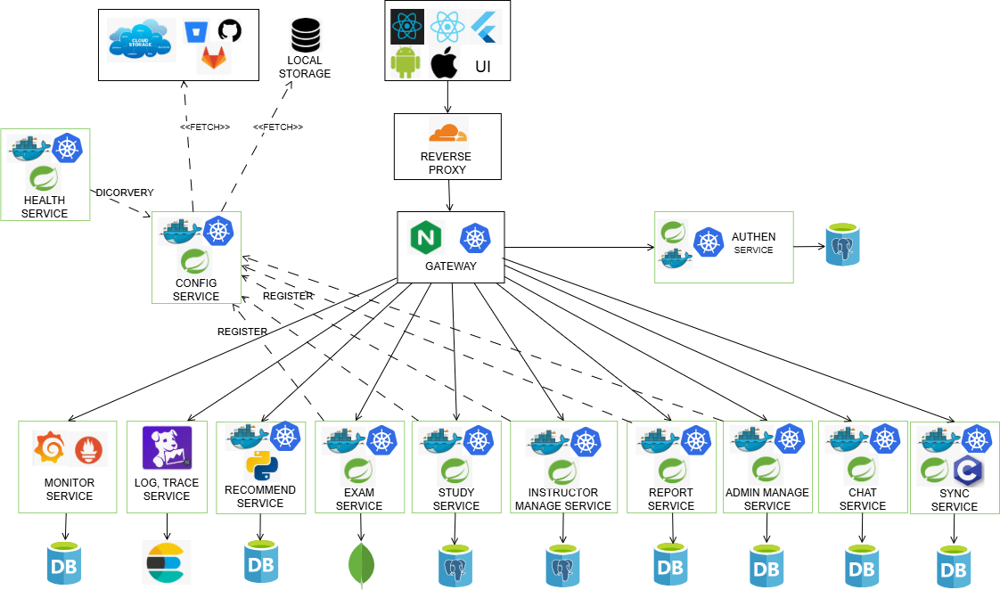
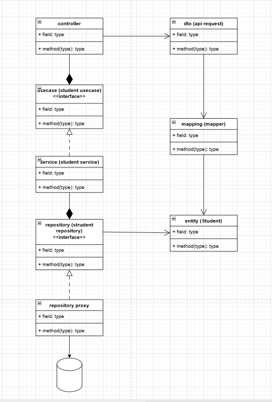
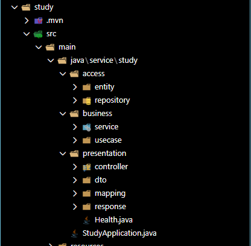

# KTPM — Kiến trúc phần mềm & Tài liệu triển khai

Mục đích: 
- Mô tả tổng quan kiến trúc microservice, cách chạy, cấu hình chính và tài liệu API của workspace.
- Áp dụng SOLID, OOP design pattern, software design & architechture
## Tổng quan kiến trúc
- Kiến trúc: Microservices (Tech-stack Diagram)
- Sẵn sàng để chuyển đổi triển khai CI-CD.

## Software Diagram - Software Document 

### UI - FIGMA
[Link Liên kết design figma](https://www.figma.com/design/hJtrpv48cxPbG0I4cgqIqq/-HK251--Software-Arch-Assignment?node-id=16-481&p=f&t=CkjQ8sMO0JPOyZPh-0)
### Tech-Stack Diagram 

### Source tree call (SOLID)

### Class Diagram
[Module study](docs/img/module_study_class.drawio.png)

[Module schedule](docs/img/module_schedule_class.drawio.png)
### Source code view
[Source code view](docs/img/source_tree_call.png)

## Dự án & file chính
- Entry points (Spring Boot):
  - [`service.study.StudyApplication`](study/src/main/java/service/study/StudyApplication.java) — [study/src/main/java/service/study/StudyApplication.java](study/src/main/java/service/study/StudyApplication.java)
  - [`service.submit.SubmitApplication`](submit/src/main/java/service/submit/SubmitApplication.java) — [submit/src/main/java/service/submit/SubmitApplication.java](submit/src/main/java/service/submit/SubmitApplication.java)
  - [`service.eureka.EurekaApplicationTests` (test class)`](eureka/src/test/java/service/eureka/EurekaApplicationTests.java) — [eureka/src/test/java/service/eureka/EurekaApplicationTests.java](eureka/src/test/java/service/eureka/EurekaApplicationTests.java)

- Docker & CI:
  - [study/Dockerfile](study/Dockerfile)
  - [submit/Dockerfile](submit/Dockerfile)
  - [project/nginx.conf](project/nginx.conf)

- Maven / wrapper:
  - [study/pom.xml](study/pom.xml)
  - [submit/pom.xml](submit/pom.xml)
  - Wrapper (Windows / *nix):
    - [study/mvnw](study/mvnw) — [study/mvnw.cmd](study/mvnw.cmd)
    - [submit/mvnw](submit/mvnw) — [submit/mvnw.cmd](submit/mvnw.cmd)
    - Wrapper properties:
      - [config/.mvn/wrapper/maven-wrapper.properties](config/.mvn/wrapper/maven-wrapper.properties)
      - [eureka/.mvn/wrapper/maven-wrapper.properties](eureka/.mvn/wrapper/maven-wrapper.properties)
      - [submit/.mvn/wrapper/maven-wrapper.properties](submit/.mvn/wrapper/maven-wrapper.properties)

- Cấu hình ứng dụng:
  - Study application.yml: [study/src/main/resources/application.yml](study/src/main/resources/application.yml)
  - Submit application.yaml: [submit/src/main/resources/application.yaml](submit/src/main/resources/application.yaml)
  - Config server (local repo): [config/src/main/resources/application.yaml](config/src/main/resources/application.yaml) và repo: `config-repo/`

- API docs / Postman:
  - [ktpm_study.postman_collection.json](ktpm_study.postman_collection.json)
  - [ktpm_submit.postman_collection.json](ktpm_submit.postman_collection.json)

- Một vài lớp dữ liệu / mapping tham khảo:
  - Chapter entity: [`service.study.access.entity.Chapter`](study/src/main/java/service/study/access/entity/Chapter.java) — [study/src/main/java/service/study/access/entity/Chapter.java](study/src/main/java/service/study/access/entity/Chapter.java)
  - Chapter DTO / Mapper: [`service.study.presentation.dto.ChapterDTO`](study/src/main/java/service/study/presentation/dto/ChapterDTO.java) — [study/src/main/java/service/study/presentation/dto/ChapterDTO.java](study/src/main/java/service/study/presentation/dto/ChapterDTO.java)  
    [`service.study.presentation.mapping.ChapterMapper`](study/src/main/java/service/study/presentation/mapping/ChapterMapper.java) — [study/src/main/java/service/study/presentation/mapping/ChapterMapper.java](study/src/main/java/service/study/presentation/mapping/ChapterMapper.java)
  - Exam entity / DTO (submit): [`service.submit.access.entity.Exam`](submit/src/main/java/service/submit/access/entity/Exam.java) — [submit/src/main/java/service/submit/access/entity/Exam.java](submit/src/main/java/service/submit/access/entity/Exam.java)  
    [`service.submit.presentation.dto.ExamDTO`](submit/src/main/java/service/submit/presentation/dto/ExamDTO.java) — [submit/src/main/java/service/submit/presentation/dto/ExamDTO.java](submit/src/main/java/service/submit/presentation/dto/ExamDTO.java)

## Chạy & debug (local)
1. Config server (để phục vụ cấu hình):
   - chạy trong thư mục [config](config)
   - mvn: ./mvnw spring-boot:run hoặc mvn spring-boot:run
2. Eureka:
   - chạy [eureka](eureka) trên port 8761
3. Study:
   - chạy [study](study): ./mvnw spring-boot:run (port 8081) — cấu hình: [study/src/main/resources/application.yml](study/src/main/resources/application.yml)
4. Submit:
   - chạy [submit](submit): ./mvnw spring-boot:run (port 8083) — cấu hình: [submit/src/main/resources/application.yaml](submit/src/main/resources/application.yaml)
5. Proxy:
   - Sử dụng [project/nginx.conf](project/nginx.conf) nếu cần reverse-proxy.

Hoặc build bằng Docker theo Dockerfile trong mỗi service.

## API & kiểm thử
- Import Postman collections:
  - [ktpm_study.postman_collection.json](ktpm_study.postman_collection.json)
  - [ktpm_submit.postman_collection.json](ktpm_submit.postman_collection.json)

## Cấu trúc kho (tóm tắt)
- [study/](study) — service nội dung (port 8081)
- [submit/](submit) — service nộp bài (port 8083)
- [eureka/](eureka) — service registry
- [config/](config) — config server
- [config-repo/](config-repo) — cấu hình tĩnh cho config server
- [project/nginx.conf](project/nginx.conf) — mẫu nginx reverse-proxy
- [Instruction.md](Instruction.md) — hướng dẫn nhanh

## Ghi chú vận hành / TODO
- Điền thông tin database trong [study/src/main/resources/application.yml](study/src/main/resources/application.yml) và [submit/src/main/resources/application.yaml](submit/src/main/resources/application.yaml).
- Kiểm tra `mvnw` / `.mvn/wrapper` nếu chạy trên môi trường không có Maven cài sẵn.

## Tham khảo nhanh
- Start bằng Maven Wrapper: use [study/mvnw](study/mvnw) và [submit/mvnw](submit/mvnw)
- Dockerfiles: [study/Dockerfile](study/Dockerfile), [submit/Dockerfile](submit/Dockerfile)

---

